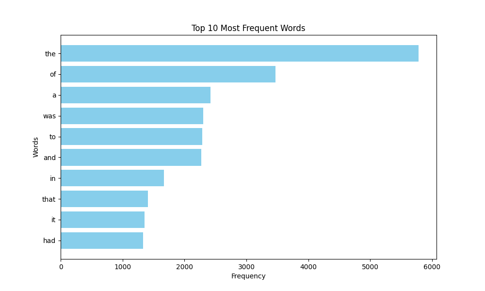

# "Fundamentals of Parallel Computing and the MapReduce Model"

Welcome! 🧠

In today's world of information technology, processing large amounts of data requires efficient and fast methods. Your task is to write a Python script that applies the MapReduce paradigm to analyze word frequency in a text and visualize the results.

Completing this homework will help you develop skills in efficiently processing large files. You will gain hands-on experience using Python’s parallel computing capabilities to speed up execution.

💡 If you previously took the course "Computer Systems and Their Fundamentals," you might notice that this task is identical to Task 2 from the homework after Topic 10, "Introduction to Parallel Computing." In this case, you can submit your previous solution instead of starting from scratch.

Links and attached files are required for the homework to be accepted!

Let's get started! 💪🏼

## Task

Write a Python script that downloads text from a given URL, analyzes word frequency in the text using the MapReduce paradigm, and visualizes the top words with the highest frequency.

### Step-by-Step Instructions

1. Import the necessary modules (`matplotlib` and others).

2. Use the MapReduce implementation from the course notes.

3. Create a `visualize_top_words` function to visualize the results.

4. In the main code block, retrieve the text from the URL, apply MapReduce, and visualize the results.

Example

### Acceptance Criteria

📌 The acceptance criteria for this homework are mandatory for mentor review. If any of the criteria are not met, the mentor will return the homework for revision without grading. If you "just need clarification" 😉 or get "stuck" on any step, feel free to ask your mentor on Slack.

1. The code successfully downloads text from the given URL.

2. The code correctly analyzes word frequency using MapReduce.

3. The visualization displays the top words by frequency.

4. The code efficiently utilizes multithreading.

5. The code is readable and follows PEP 8 standards.
